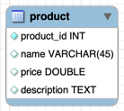

# whatap-product

와탭랩스 백엔드 개발자 채용 과제 프로젝트 product server입니다.

---
## 목차
1. [기술 요구 사항](#기술-요구-사항)
2. [기능 요구 사항](#기능-요구-사항)
3. [디렉토리 구조](#디렉토리-구조)
4. [데이터베이스 스키마](#데이터베이스-스키마)
5. [API 명세]

---

## 기술 요구 사항

언어: Java 17 <br>
프레임워크: Quarkus 3.8.1 <br>
데이터베이스: PostgreSQL <br>
ORM: Panache

---

## 기능 요구 사항

1. 제품 조회
2. 제품 pagiantion 조회
3. 제품 추가
4. 제품 수정
5. 제품 삭제

---

## 디렉토리 구조
```
java
+--controller
|    +--ProductController.java
|
+--dto
|   +--res
|   |    +--ProductResponseDto.java
|   |
|   +--req
|        +--ProdcutRequestDto.java
|
+--entity
|   +--Product.java
|
+--excption
|   +--CustomException.java
|   |
|   +--CustomExceptionHandler.java
|   |
|   +--ProductNotFoundException.java
|
+--repository
|   +--ProductRepository.java
|
+--service
    +--ProdouctService
```
---

## 데이터베이스 스키마


---

## API 명세

모든 요청과 응답의 Content-Type은 application/json입니다.

| API                    | API URL              | Method | Request                                                             | Response                                                                                     | StatusCode |
|------------------------|----------------------|--------|---------------------------------------------------------------------|----------------------------------------------------------------------------------------------|------------|
| getProduct             | /product/get/{id}    | GET    |                                                                     | {<br>"id": int,<br>"name": String,<br>"price": int,<br>"description": String<br>}            | 200        |
| getProductByPagination | /product/get/page    | GET    | page?int<br>size?int                                                | [<br> {<br>"id": int,<br>"name: String,<br>"price": int,<br>"description": String<br> }<br>] | 200        |
| addProduct             | /product/add         | POST   | {<br>"name": string,<br>"price": int,<br>"description": string<br>} |                                                                                              | 201        |
| updateProduct          | /product/update/{id} | PUT    | {<br>"name": string,<br>"price": int,<br>"description": string<br>} |                                                                                              | 201        |
| deleteProduct          | /product/delete/{id} | DELETE |                                                                     |                                                                                              | 204        |